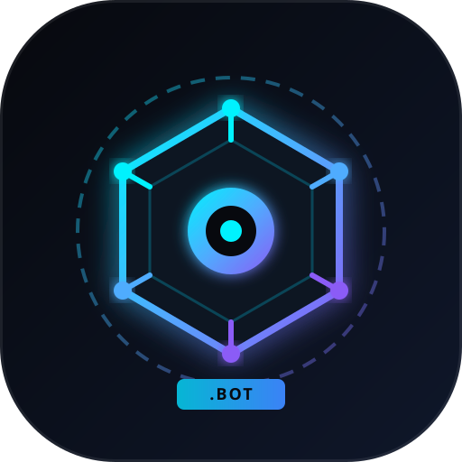

# ⚡ BotNS — Botchain Name Service (.bot)

<div align="center">
  
  <h3>The Decentralized Web3 Identity & Domain Protocol on Botchain</h3>
  <p>Human-readable <strong>.bot</strong> domain names replacing hexadecimal addresses across the Botchain EVM.</p>
</div>

---

## 🌟 Overview

**BotNS (Botchain Name Service)** is a high-performance, decentralized naming system natively built for the **Botchain (Bohr) Network**. It maps human-readable `.bot` names (e.g. `satoshi.bot`, `alex.bot`) to EVM machine identifiers like wallet addresses, subdomains, avatars, social profiles, and IPFS/Arweave content hashes.

Everything is stored **100% on-chain**, eliminating the need for centralized databases and ensuring total sovereignty, security, and censorship resistance.

---

## 🚀 Live Botchain Testnet Deployment

| Parameter | Specification |
| :--- | :--- |
| **Network Name** | Botchain Testnet (Bohr) |
| **Chain ID** | `968` |
| **RPC Endpoint** | `https://rpc.bohr.life` |
| **Block Explorer** | [https://scan.bohr.life](https://scan.bohr.life) |
| **Native Token** | `BOT` (18 Decimals) |
| **TLD Extension** | `.bot` |
| **Deployed Contract** | [`0x0b1a2cdc35bf786c1cb17536667dfbf7d03d5a77`](https://scan.bohr.life/address/0x0b1a2cdc35bf786c1cb17536667dfbf7d03d5a77) |
| **Deployment TX** | [`0xa1117fd046bd7c6c01610ead078b5c523a526ecb5f74d7ff48277f267d4a4e84`](https://scan.bohr.life/tx/0xa1117fd046bd7c6c01610ead078b5c523a526ecb5f74d7ff48277f267d4a4e84) |

---

## ✨ Features

- 🔍 **Real-Time Availability Checker**: Instant query validation and tier calculation.
- 💎 **Length-Based Pricing Tiers**:
  - **1–2 Characters (Ultra Rare):** `50 BOT` / year
  - **3 Characters (Rare):** `20 BOT` / year
  - **4 Characters (Popular):** `10 BOT` / year
  - **5+ Characters (Standard):** `2 BOT` / year
- 🔄 **Reverse Resolution**: Set your primary `.bot` username for dApps (`reverseRecords`).
- 🌐 **Multi-Record Management**: Link Twitter/X, GitHub, Email, Avatars, and IPFS Content Hashes directly to your domain.
- 🌳 **Subdomains**: Create unlimited subdomains (e.g., `pay.alex.bot`, `dao.botchain.bot`).
- 👛 **Reown AppKit & Wagmi**: Multi-wallet connection supporting MetaMask, WalletConnect, Coinbase Wallet, Rainbow, and Rabby.
- 🎨 **Modern Cyberpunk UI**: Built with Tailwind CSS, glassmorphism, responsive layouts, and dark mode aesthetics.

---

## 🛠️ Tech Stack

- **Frontend & Backend**: [Next.js 14 (App Router)](https://nextjs.org), [React 18](https://react.dev), [TypeScript](https://www.typescriptlang.org/)
- **Styling**: [Tailwind CSS v3](https://tailwindcss.com), PostCSS, CSS Grid, Glassmorphism tokens
- **Web3 Integrations**:
  - [`@reown/appkit`](https://reown.com) (AppKit Web3 Modal)
  - [`@reown/appkit-adapter-wagmi`](https://wagmi.sh)
  - [`wagmi@2.x`](https://wagmi.sh) & [`viem`](https://viem.sh)
  - [`@tanstack/react-query`](https://tanstack.com/query)
- **Smart Contracts**: [Solidity 0.8.20](https://soliditylang.org/) (`contracts/BotNameService.sol`)

---

## 📦 Getting Started

### 1. Clone the repository
```bash
git clone https://github.com/your-username/botchain-domains.git
cd botchain-domains
```

### 2. Install dependencies
```bash
npm install
```

### 3. Setup Environment Variables
Create a `.env.local` file in the root directory:
```env
# Reown (WalletConnect) Project ID (Get yours free from https://cloud.reown.com)
NEXT_PUBLIC_PROJECT_ID=your_reown_project_id

# Deployed Smart Contract Address
NEXT_PUBLIC_BNS_CONTRACT_ADDRESS=0x0b1a2cdc35bf786c1cb17536667dfbf7d03d5a77

# Botchain Testnet Config
NEXT_PUBLIC_CHAIN_ID=968
NEXT_PUBLIC_RPC_URL=https://rpc.bohr.life
NEXT_PUBLIC_EXPLORER_URL=https://scan.bohr.life
```

### 4. Run Development Server
```bash
npm run dev
# or on Windows PowerShell if scripts are restricted:
npm.cmd run dev
```

Open [http://localhost:3000](http://localhost:3000) (or [http://localhost:3001](http://localhost:3001)) to view the application.

---

## 📜 Smart Contract Architecture

The primary smart contract is located at [`contracts/BotNameService.sol`](./contracts/BotNameService.sol).

### Key Functions
- `getPrice(string name, uint256 durationYears)`: Returns the cost in `BOT` wei.
- `isAvailable(string name)`: Checks if a name is unregistered or expired past the grace period.
- `register(string name, address targetAddress, uint256 durationYears)`: Registers a `.bot` domain name.
- `renew(string name, uint256 durationYears)`: Extends the registration period.
- `setPrimaryName(string name)`: Sets reverse resolution for `msg.sender`.
- `setResolvedAddress(string name, address newAddress)`: Updates target EVM address.
- `setTextRecord(string name, string key, string value)`: Stores custom metadata (avatar, twitter, etc.).
- `createSubdomain(string parentName, string subLabel, address targetAddress)`: Deploys a new subdomain.
- `resolve(string name)`: Returns the target address, owner, and expiry status.

### Redeploying the Contract
If you want to redeploy a new instance to Botchain Testnet:
```bash
node scripts/deploy.js
```

---

## 📄 License

This project is open-source under the [MIT License](LICENSE).
