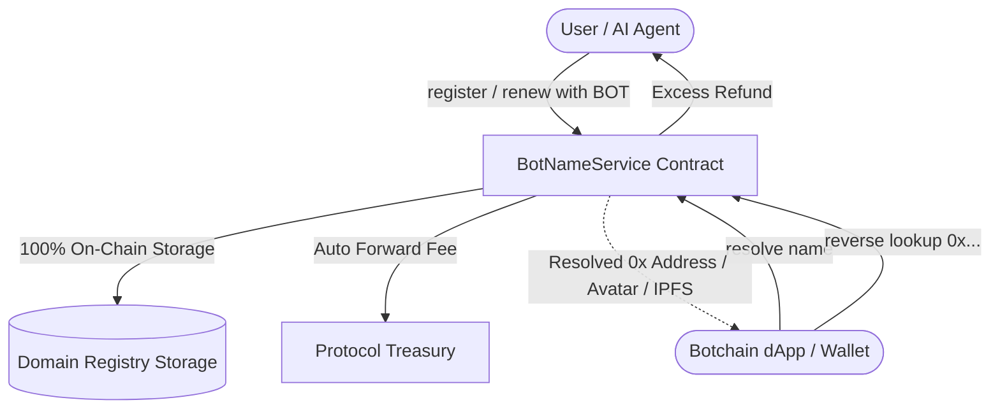

# ⚡ BotNS: Botchain Name Service (.bot)
## Decentralized Web3 Identity & Domain Protocol for the Botchain Ecosystem
**Official Technical Whitepaper — Version 1.0**  
*Network: BOT Chain Mainnet (Chain ID: 677) | Contract: 0x2ce45ff1847273f0fd11714744c4f238d004e026*

---

## 1. Executive Summary

As decentralized networks and autonomous AI agent architectures expand, user and machine interaction on blockchains continues to suffer from severe usability friction: 42-character hexadecimal EVM addresses (`0x...`). These cryptic strings are unreadable, prone to costly human clipboard errors, and lack identity metadata.

**BotNS (Botchain Name Service)** provides the foundational identity infrastructure for the **Botchain (Bohr) Network**. It maps human-readable `.bot` top-level domains (e.g., `agent.bot`, `satoshi.bot`) directly to machine identifiers, multi-chain addresses, decentralized content hashes (IPFS/Arweave), and customizable Web2/Web3 social records. Built 100% on-chain with native EVM smart contracts, BotNS delivers censorship resistance, zero centralized dependencies, and native compatibility with AI agents, wallets, and decentralized applications across the Botchain ecosystem.

---

## 2. Problem Statement

Blockchains are engineered for cryptographic security, not human psychology. The current infrastructure presents several critical barriers:

1. **Transaction Vulnerability & UX Friction**: Transferring assets or interacting with smart contracts requires copying and pasting 42-character hexadecimal addresses. A single mistyped character or clipboard-hijacking malware results in irreversible loss of capital.
2. **Identity Fragmentation**: Wallets across Botchain lack a unified, verifiable identity layer. Users, decentralized autonomous organizations (DAOs), and automated bots operate anonymously without reputational anchors or social verifiability.
3. **AI Agent Identification**: On an AI-centric network like Botchain, automated agents, oracles, and bots require persistent, discoverable on-chain handles to negotiate payments, delegate tasks, and authenticate identities across protocols.
4. **Centralized Domain Fragility**: Traditional DNS (.com, .io) is managed by centralized registrars subject to arbitrary seizures, domain spoofing, and recurring third-party fee exploitation.

---

## 3. The BotNS Solution

BotNS resolves these problems by providing an autonomous, on-chain naming and resolution engine tailored for the Botchain EVM:

* **Human-Readable Addresses**: Replaces `0x2ce45ff...` with intuitive, memorable `.bot` names.
* **100% On-Chain Integrity**: All domain registries, text metadata, expiration states, and resolution pointers are stored immutably on-chain on Botchain Mainnet.
* **Bi-Directional Resolution**: Supports both forward lookup (`satoshi.bot` ➔ `0x...`) and reverse resolution (`0x...` ➔ `satoshi.bot`), enabling any dApp to display human names instantly.
* **Cross-Protocol Data Layer**: Stores IPFS content hashes for decentralized Web3 websites, subdomains, and text records (Twitter/X, Telegram, GitHub, email, and avatar URLs).
* **Direct Treasury Distribution**: Transaction fees are routed transparently and automatically to the protocol treasury, preventing locked capital and eliminating intermediation risk.

---

## 4. Smart Contract Architecture

The BotNS protocol is governed by an optimized Solidity smart contract (`BotNameService.sol`) deployed and verified on Botchain Mainnet.

### 4.1 System Diagram


### 4.2 Core Data Structures

```solidity
struct Domain {
    string name;             // e.g. "oracle"
    address owner;           // Domain registrant / administrator
    address resolvedAddress; // Target recipient EVM address
    uint256 registeredAt;    // Block timestamp of creation
    uint256 expiresAt;       // Block timestamp of expiration
    string contentHash;      // IPFS or Arweave hash for decentralized sites
    bool exists;
}

struct Subdomain {
    address resolvedAddress;
    bool exists;
}
```

### 4.3 Key Protocol Mechanisms

* **Reverse Resolution**: Wallets can bind their primary `.bot` domain using `setPrimaryName()`. The network returns this canonical handle for global Web3 display.
* **Custom Text Records**: Protocol supports arbitrary key-value mappings (e.g. `com.twitter`, `avatar`, `email`, `description`) via `setTextRecord()`.
* **Hierarchical Subdomains**: Any domain owner can issue infinite second-level subdomains via `createSubdomain()` (e.g. `pay.agent.bot`, `api.agent.bot`) without additional protocol fees.
* **Grace Period Safeguard**: A built-in **30-day grace period** prevents domains from being immediately claimed upon expiration, protecting users against accidental expirations.
* **Automated Excess Refund**: If a user submits excess `BOT` gas/value during batch or single registrations, the contract automatically computes the exact annual fee and returns the remainder to `msg.sender`.

---

## 5. Economics & Tiered Pricing Model

To ensure fair domain distribution, discourage squatting on short identifiers, and maintain sustainable protocol reserves, BotNS implements length-based tier pricing denominated in native `BOT` tokens:

| Tier | Character Length | Classification | Annual Fee (BOT) | Target Use Case |
| :--- | :--- | :--- | :--- | :--- |
| **Tier 1** | 1 – 2 Characters | Ultra Rare | `50 BOT` / year | High-value brands, prominent protocols, elite identifiers |
| **Tier 2** | 3 Characters | Rare | `20 BOT` / year | Liquid 3-letter acronyms, ticker symbols, DAO handles |
| **Tier 3** | 4 Characters | Popular | `10 BOT` / year | Common names, handles, project identifiers |
| **Tier 4** | 5+ Characters | Standard | `2 BOT` / year | General public, everyday wallets, individual AI agents |

*Registration duration can be configured for 1 to 10+ years with linear annual pricing.*

---

## 6. Technical Specifications & Deployment

* **Network**: BOT Chain Mainnet
* **Chain ID**: `677`
* **RPC Endpoint**: `https://rpc.botchain.ai`
* **Block Explorer**: `https://scan.botchain.ai`
* **Smart Contract Address**: [`0x2ce45ff1847273f0fd11714744c4f238d004e026`](https://scan.botchain.ai/address/0x2ce45ff1847273f0fd11714744c4f238d004e026)
* **Deployment Transaction**: [`0x256c2593c5dba46497177d79ca282d41e516fdf486ea90b54a97fd66f9f74163`](https://scan.botchain.ai/tx/0x256c2593c5dba46497177d79ca282d41e516fdf486ea90b54a97fd66f9f74163)
* **Frontend Architecture**: Next.js 14 App Router, React 18, Tailwind CSS, Reown AppKit & Wagmi v2 / Viem.

---

## 7. Ecosystem Integration & AI Agent Roadmap

BotNS is designed to be the foundational identification layer for autonomous bots and decentralized applications:

```
[Phase 1: Core Launch - COMPLETED]
├── Mainnet Smart Contract Deployment (Chain ID: 677)
├── Live dApp with Real-Time Availability & Registration
├── Multi-Wallet Support (Reown, MetaMask, Coinbase, Rainbow)
└── Reverse Records, Text Records, & Subdomains

[Phase 2: Ecosystem Integrations - CURRENT]
├── Botchain Block Explorer Integration (Display .bot instead of 0x)
├── Standard Resolution SDK (NPM package for Botchain dApps)
└── Decentralized Web3 Hosting integration with IPFS gateway resolution

[Phase 3: Autonomous AI Agent Identity]
├── Agent-to-Agent Autonomous Registry API
├── Verified AI Agent Credential Badges
└── Machine-to-Machine micro-payment routing via .bot endpoints

[Phase 4: Decentralized Governance & Secondary Marketplace]
├── Native .bot Domain Trading & Transfer Marketplace
└── DAO Governance handover for protocol fee parameterization
```

---

## 8. Conclusion

BotNS delivers the missing piece of the Botchain ecosystem: a secure, intuitive, and sovereign identity standard. By bridging human readability with machine-executable smart contract verification, BotNS sets the stage for mainstream user onboarding and seamless AI agent collaboration across the decentralized web.

**Website & dApp**: [https://botns.domains](https://botns.domains) *(or local deployment)*  
**Source Code**: Open-source MIT License  
**Network**: Botchain Mainnet (Chain ID: 677)
